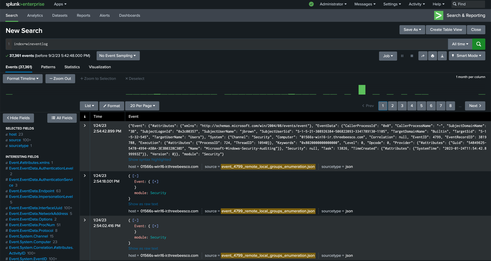
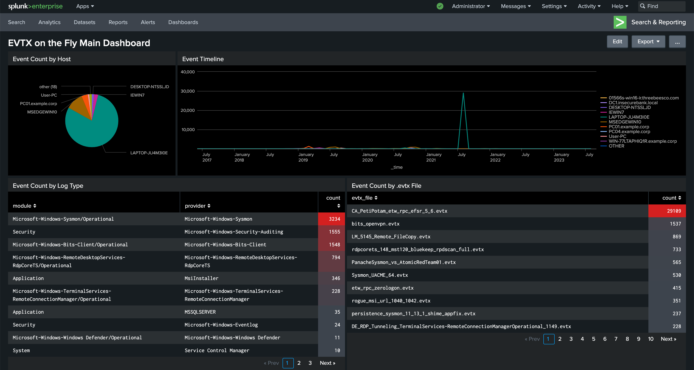

# evtx2splunk docker

Deploy a Splunk, convert EVTXs, send in Splunk.

*Note : If you are using Apple Silicon processors (M1, M2), unfortunetaly you cannot use this repo because Splunk's docker image does not support M1-M2.*

## Usage

*It requires docker compose installation.*

1. Put your evtx files into "evtx_files" directory.
2. Run `docker compose up -d` in the main directory.

It will download some images from Docker Hub and deploy a Splunk environment.

To reach Splunk, go to http://localhost:8000

- Username: admin
- Password: password

### Push logs

```shell
$ docker exec -it evtx_converter python3 /evtx2splunk/evtx2splunk.py --input evtx_files --index <index_name>
```

## Screenshot



The Splunk also contains a main dashboard that shows some data about your evtx files.



## Credits

- [evtx2splunk](https://github.com/whikernel/evtx2splunk) : For more information about the evtx2splunk script
- [splunk-evtx-onthefly](https://github.com/krdmnbrk/splunk-evtx-onthefly)
